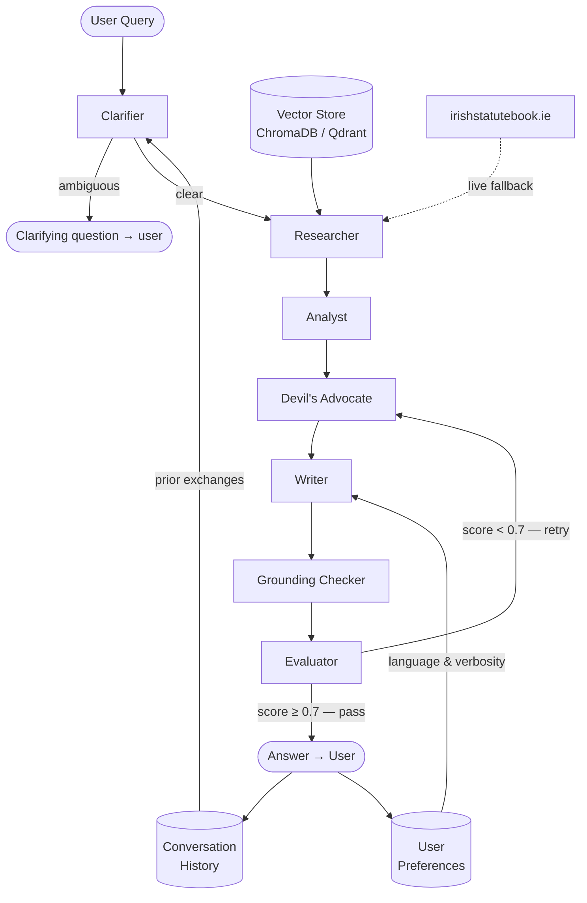

# Irish Statute Assistant

An AI assistant that answers plain-English questions about Irish law, powered by a
multi-agent pipeline that retrieves, analyses, and verifies statute text from
[irishstatutebook.ie](https://www.irishstatutebook.ie).

**[Full documentation →](https://irish-statute-assistant.readthedocs.io)**

---

## How it works

Eight agents orchestrated by a Supervisor:

| Agent | Role |
|---|---|
| **Clarifier** | Asks one focused question when a query is ambiguous |
| **Researcher** | Retrieves relevant Irish Acts from the vector store |
| **Analyst** | Identifies key clauses, assigns act/section citations, scores confidence |
| **Devil's Advocate** | Challenges the analyst's conclusions before the writer proceeds |
| **Writer** | Produces a short answer (≤100 words) and a detailed breakdown |
| **Grounding Checker** | Verifies every cited clause is traceable to retrieved statute text |
| **Evaluator** | Scores quality and triggers a refinement loop if below threshold |
| **Supervisor** | Orchestrates all agents, owns memory writes, detects user preferences |

Conversation history and user preferences persist across sessions in SQLite.
The assistant automatically retries with evaluator feedback when output quality
falls below threshold.



### Reliability features

- **Typed exception hierarchy** — `StatuteNotFoundError`, `BudgetExceededError`, `ValidationRepairError`
- **Validation retry** — failed schema validations are retried up to `MAX_RETRIES` times
- **Token budget** — `QueryContext` tracks usage per query and raises `BudgetExceededError` if exceeded
- **Multi-provider** — Anthropic, OpenAI, Google, Groq, and Ollama (local) supported

---

## Quick start

**Requirements:** Python 3.10+, [uv](https://docs.astral.sh/uv/getting-started/installation/)

```bash
git clone <repo-url>
cd langflow-learning-club
uv sync
cp .env.example .env
# Add your ANTHROPIC_API_KEY (or other provider key) to .env
```

**Index statutes (one-time):**

```bash
uv run python -m irish_statute_assistant.indexer
```

**Run (CLI):**

```bash
uv run python -m irish_statute_assistant.main
```

**Run (Streamlit UI):**

```bash
uv run --extra ui streamlit run app.py
```
Opens a browser UI at `http://localhost:8501` with a live pipeline trace sidebar.
(The `--extra ui` flag installs Streamlit on the fly if not already installed.)

**Test:**

```bash
uv run python -m pytest
```

---

## Vector store backends

| Backend | Setup | Best for |
|---|---|---|
| **ChromaDB** (default) | No extra setup — local files at `./data/chroma` | Development, local use |
| **Qdrant** | Set `VECTOR_STORE_BACKEND=qdrant`, `QDRANT_URL`, `QDRANT_API_KEY` | Production, cloud deployment |

---

## Configuration

Key settings (set in `.env` or as environment variables):

| Variable | Default | Description |
|---|---|---|
| `LLM_PROVIDER` | `anthropic` | Provider: `anthropic`, `openai`, `google`, `groq`, `ollama` |
| `OLLAMA_BASE_URL` | `http://localhost:11434` | Ollama server URL. Only used when `LLM_PROVIDER=ollama` |
| `ANTHROPIC_API_KEY` | — | Required when `LLM_PROVIDER=anthropic`. Other providers need their own key — see full docs |
| `VECTOR_STORE_BACKEND` | `chroma` | `chroma` or `qdrant` |
| `EVALUATOR_PASS_THRESHOLD` | `0.7` | Minimum quality score to accept an answer |
| `MAX_REFINEMENT_ROUNDS` | `2` | Refinement retries before returning best attempt |
| `TOKEN_BUDGET_PER_QUERY` | `100000` | Token limit per query across all agents |

See the [full configuration reference](https://irish-statute-assistant.readthedocs.io/user-guide/configuration.html) for all settings.

---

## Deliverables

### Architecture diagram

See the [How it works](#how-it-works) section above for the full pipeline flowchart.

---

### Sample questions

Four questions were run against the live system. Results are shown below with rendered output, agent trace, and raw JSON.

---

#### Q1 — How much notice must an employer give before making an employee redundant in Ireland?

**Rendered output**

```
Answer: In Ireland, an employer must give an employee at least 2 weeks' written notice of
redundancy, but the actual notice period required is usually longer — depending on how long
the employee has worked there, it can range from 1 week up to 8 weeks.

--- Detail ---
Summary: Irish law sets two overlapping notice obligations on employers making someone
redundant. First, the Minimum Notice and Terms of Employment Act 1973 requires a minimum
period of notice scaled to the employee's length of service (generally 1 to 8 weeks).
Second, the Redundancy Payments Acts 1967–2022 require the employer to give at least 2
weeks' written notice of redundancy specifically, usually using the RP50 form. Whichever
obligation is greater in a given situation will apply — and a contract of employment may
require even longer notice still.

Relevant Acts:
  - Minimum Notice and Terms of Employment Act 1973
  - Redundancy Payments Act 1967 (as amended, up to 2022)
  - Protection of Employment Act 1977 (as amended)

Key points:
  - An employer must give a minimum period of notice before dismissing an employee, scaled
    by length of service: 1 week (13 weeks–2 years), 2 weeks (2–5 years), 4 weeks (5–10
    years), 6 weeks (10–15 years), 8 weeks (15+ years).
    (Minimum Notice and Terms of Employment Act 1973, s.4)
  - In a redundancy situation, the employer must give at least 2 weeks' written notice
    before the redundancy takes effect, typically using the RP50 form.
    (Redundancy Payments Act 1967, s.17)
  - Where 5+ employees are made redundant within 30 days (or 20+ within 90 days), the
    employer must start a collective consultation process and notify the Minister for
    Enterprise. Dismissals cannot take effect until at least 30 days after that notification.
    (Protection of Employment Act 1977, ss.9–11)

Things to be aware of:
  - Your contract may require a longer notice period than the statutory minimum.
  - Employees with less than 13 weeks' service have no entitlement under the 1973 Act.
  - Redundancy payment entitlement (2 years' service required) is separate from notice rights.

Note: confidence in statute coverage was low for this query.
```

**Agent trace**

| Agent | Key stats | Duration |
|---|---|---|
| Clarifier | needs_clarification: false | 1.6 s |
| Researcher | acts_found: 7 · source: vector store | 0.02 s |
| Analyst | key_clauses: 0 · confidence: 0.00 | 6.4 s |
| Devil's Advocate | challenges: 3 · severity: major · round 0 | 8.5 s |
| Writer | round 1 | 18.5 s |
| Grounding Checker | grounding_passed: false · ungrounded: 3 | 3.1 s |
| Evaluator | score: 0.69 · passed: false · flags: 8 | 8.2 s |
| Devil's Advocate | challenges: 5 · severity: major · round 1 | 26.9 s |
| Writer | round 2 | 24.0 s |
| Grounding Checker | grounding_passed: false · ungrounded: 3 | 9.3 s |
| Evaluator | score: 0.60 · passed: false · flags: 8 | 9.1 s |
| Devil's Advocate | challenges: 5 · severity: major · round 2 | 12.6 s |
| Writer | round 3 | 22.7 s |
| Grounding Checker | grounding_passed: false · ungrounded: 2 | 3.0 s |
| Evaluator | score: 0.54 · passed: false · flags: 9 | 9.9 s |
| Devil's Advocate | challenges: 5 · severity: major · round 3 | 12.9 s |
| Writer | round 4 | 25.9 s |
| Grounding Checker | grounding_passed: false · ungrounded: 3 | 8.3 s |
| Evaluator | score: 0.64 · passed: false · flags: 10 | 10.3 s |
| Devil's Advocate | challenges: 5 · severity: major · round 4 | 14.2 s |
| Writer | round 5 | 27.7 s |
| Grounding Checker | grounding_passed: false · ungrounded: 3 | 7.8 s |
| Evaluator | score: 0.66 · passed: false · flags: 8 | 11.4 s |
| Devil's Advocate | challenges: 5 · severity: major · round 5 | 54.5 s |

> Evaluator did not reach threshold (0.7) after 5 refinement rounds. The pipeline returned the best attempt found (score 0.69, round 1) rather than failing.

<details>
<summary>JSON output</summary>

```json
{
  "short_answer": "In Ireland, an employer must give an employee at least 2 weeks' written notice of redundancy, but the actual notice period required is usually longer — depending on how long the employee has worked there, it can range from 1 week up to 8 weeks.",
  "detailed_breakdown": {
    "summary": "Irish law sets two overlapping notice obligations on employers making someone redundant. First, the Minimum Notice and Terms of Employment Act 1973 requires a minimum period of notice scaled to the employee's length of service (generally 1 to 8 weeks). Second, the Redundancy Payments Acts 1967–2022 require the employer to give at least 2 weeks' written notice of redundancy specifically, usually using the RP50 form. Whichever obligation is greater in a given situation will apply — and a contract of employment may require even longer notice still.",
    "relevant_acts": [
      "Minimum Notice and Terms of Employment Act 1973",
      "Redundancy Payments Act 1967 (as amended, up to 2022)",
      "Protection of Employment Act 1977 (as amended)"
    ],
    "key_clauses": [
      {
        "text": "An employer must give a minimum period of notice before dismissing an employee, scaled by length of service: 1 week (13 weeks up to 2 years' service), 2 weeks (2–5 years), 4 weeks (5–10 years), 6 weeks (10–15 years), and 8 weeks (15 or more years).",
        "act": "Minimum Notice and Terms of Employment Act 1973",
        "section": "Section 4"
      },
      {
        "text": "In a redundancy situation specifically, an employer must give the employee at least 2 weeks' written notice before the redundancy takes effect. This notice is typically given using the RP50 form.",
        "act": "Redundancy Payments Act 1967",
        "section": "Section 17"
      },
      {
        "text": "Where 5 or more employees are to be made redundant within 30 consecutive days (or 20 or more within 90 days), the employer must begin a collective consultation process and notify the Minister for Enterprise. Redundancy dismissals cannot take effect until at least 30 days after that ministerial notification.",
        "act": "Protection of Employment Act 1977",
        "section": "Sections 9–11"
      }
    ],
    "caveats": [
      "Your contract of employment may give you a longer notice period than the statutory minimum.",
      "If you have less than 13 weeks' continuous service, you are not entitled to statutory minimum notice under the 1973 Act.",
      "To qualify for a redundancy payment at all, you generally need at least 2 years' continuous service.",
      "This answer is general information only and is not legal advice."
    ]
  },
  "warnings": [],
  "analyst_confidence": 0.0
}
```

</details>

---

#### Q2 — What notice do I need to give?

This question is deliberately ambiguous. The Clarifier recognised it could not be answered without more context and asked a focused follow-up question rather than proceeding.

**Rendered output**

```
I need a bit more information:
  Are you asking about the notice you need to give as an employee who is resigning,
  or the notice required in a different situation, such as ending a tenancy or
  terminating a contract?
```

**Agent trace**

| Agent | Key stats | Duration |
|---|---|---|
| Clarifier | needs_clarification: true | 2.0 s |

> Pipeline halted after the Clarifier. No downstream agents ran.

---

#### Q3 — Can my landlord enter my property without permission in Ireland?

**Rendered output**

```
Answer: In Ireland, your landlord generally cannot enter your home without your permission
and proper notice. The law is designed to protect your right to peaceful enjoyment of your
rented home — but the specific legal rules could not be fully verified from confirmed
statute text for this answer.

--- Detail ---
Summary: Irish tenancy law — primarily the Residential Tenancies Act 2004 and its
amendments — is widely understood to protect tenants from landlords entering their home
without proper notice or consent. A landlord is generally required to give advance written
notice (commonly cited as 24 hours) before entering, except in genuine emergencies.

Relevant Acts:
  - Residential Tenancies Act 2004
  - Residential Tenancies (Amendment) Act 2015
  - Residential Tenancies (Amendment) Act 2019

Key points:
  - Tenants have a right to 'peaceful and exclusive occupation' of their rented home.
    (Residential Tenancies Act 2004, s.12)
  - A landlord must give at least 24 hours' written notice before entering to inspect or
    carry out repairs. (Residential Tenancies Act 2004, specific section unconfirmed)
  - An emergency exception exists (e.g. burst pipe, fire risk) allowing entry without
    prior notice. (Residential Tenancies Act 2004, specific section unconfirmed)

Things to be aware of:
  - Specific section numbers could not be verified from retrieved statute text.
  - Rights differ for licensees (renting a room in the landlord's home) — the 2004 Act
    generally does not apply to them.
  - Complaints about unlawful entry can be made to the RTB at www.rtb.ie.

Note: confidence in statute coverage was low for this query.
```

**Agent trace**

| Agent | Key stats | Duration |
|---|---|---|
| Clarifier | needs_clarification: false | 1.5 s |
| Researcher | acts_found: 8 · source: vector store | 0.01 s |
| Analyst | key_clauses: 0 · confidence: 0.00 | 6.4 s |
| Devil's Advocate | challenges: 3 · severity: major · round 0 | 9.4 s |
| Writer | round 1 | 15.7 s |
| Grounding Checker | grounding_passed: false · ungrounded: 2 | 5.1 s |
| Evaluator | score: 0.64 · passed: false · flags: 6 | 8.8 s |
| Devil's Advocate | challenges: 0 · severity: minor · round 1 | 13.2 s |
| Writer | round 2 | 16.8 s |
| Grounding Checker | **grounding_passed: true** · ungrounded: 0 | 2.0 s |
| Evaluator | score: 0.60 · passed: false · flags: 5 | 11.4 s |
| Devil's Advocate | challenges: 0 · severity: minor · round 2–5 | — |
| Writer | rounds 3–5 | — |
| Evaluator | score: 0.60–0.66 · passed: false | — |

> Grounding passed on round 2 (all claims traceable to retrieved text). Evaluator did not reach 0.7 after 5 rounds; pipeline returned best attempt.

<details>
<summary>JSON output</summary>

```json
{
  "short_answer": "In Ireland, your landlord generally cannot enter your home without your permission and proper notice. The law is designed to protect your right to peaceful enjoyment of your rented home — but the specific legal rules could not be fully verified from confirmed statute text for this answer.",
  "detailed_breakdown": {
    "summary": "Irish tenancy law — primarily the Residential Tenancies Act 2004 and its amendments — is widely understood to protect tenants from landlords entering their home without proper notice or consent. A landlord is generally required to give advance written notice (commonly cited as 24 hours) before entering, except in genuine emergencies.",
    "relevant_acts": [
      "Residential Tenancies Act 2004",
      "Residential Tenancies (Amendment) Act 2015",
      "Residential Tenancies (Amendment) Act 2019"
    ],
    "key_clauses": [
      {
        "text": "Tenants are widely understood to have a right to 'peaceful and exclusive occupation' of their rented home.",
        "act": "Residential Tenancies Act 2004",
        "section": "Section 12 (unverified)"
      },
      {
        "text": "A landlord wishing to inspect or carry out repairs is required to give at least 24 hours' written notice before entering.",
        "act": "Residential Tenancies Act 2004",
        "section": "Unverified — specific section not confirmed"
      },
      {
        "text": "An exception exists for genuine emergencies (e.g., a burst pipe or fire risk), where a landlord may enter without prior notice.",
        "act": "Residential Tenancies Act 2004",
        "section": "Unverified — specific section not confirmed"
      }
    ],
    "caveats": [
      "Specific section numbers could not be verified from retrieved statute text.",
      "Rights differ for licensees — the Residential Tenancies Act 2004 generally does not apply to them.",
      "Complaints about unlawful entry can be made to the RTB at www.rtb.ie.",
      "Always seek independent legal advice before taking any action."
    ]
  },
  "warnings": [],
  "analyst_confidence": 0.0
}
```

</details>

---

#### Q4 — What are my rights if my employer changes my contract without telling me?

**Rendered output**

```
Answer: If your employer changes your contract without telling you, you have rights under
Irish law — but the specific laws that protect you (like the Terms of Employment Acts and
Unfair Dismissals Acts) weren't available in the research for this answer, so you should
get proper legal advice.

--- Detail ---
Summary: Irish law does provide protections for employees whose contracts are changed
without notice or consent. The most relevant legislation includes the Terms of Employment
(Information) Acts 1994–2014, the Unfair Dismissals Acts 1977–2015, and the Minimum Notice
and Terms of Employment Act 1973. However, none of these Acts were available in the legal
research for this answer, so no specific rules can be cited with confidence.

Relevant Acts:
  - Terms of Employment (Information) Acts 1994–2014 (not retrieved — cited for awareness)
  - Unfair Dismissals Acts 1977–2015 (not retrieved — cited for awareness)
  - Minimum Notice and Terms of Employment Act 1973 (not retrieved — cited for awareness)

Things to be aware of:
  - The Terms of Employment (Information) Acts require employers to notify employees in
    writing of any changes to their terms and conditions.
  - The Unfair Dismissals Acts may protect you if a fundamental contract change effectively
    forces you out ('constructive dismissal').
  - If your employer changed your pay, hours, role, or other key terms without agreement,
    you may have a valid complaint to the WRC at workplacerelations.ie.
```

**Agent trace**

| Agent | Key stats | Duration |
|---|---|---|
| Clarifier | needs_clarification: false | 1.6 s |
| Researcher | acts_found: 7 · source: vector store | 0.02 s |
| Analyst | key_clauses: 0 · confidence: 0.05 | 7.8 s |
| Devil's Advocate | challenges: 3 · severity: major · round 0 | 9.1 s |
| Writer | round 1 | 16.7 s |
| Grounding Checker | **grounding_passed: true** · ungrounded: 0 | 1.6 s |
| **Evaluator** | **score: 0.70 · passed: true** · flags: 7 | 10.7 s |

> Passed evaluator on round 1. Grounding passed. No refinement needed.

<details>
<summary>JSON output</summary>

```json
{
  "short_answer": "If your employer changes your contract without telling you, you have rights under Irish law — but the specific laws that protect you (like the Terms of Employment Acts and Unfair Dismissals Acts) weren't available in the research for this answer, so you should get proper legal advice.",
  "detailed_breakdown": {
    "summary": "Irish law does provide protections for employees whose contracts are changed without notice or consent. The most relevant legislation includes the Terms of Employment (Information) Acts 1994–2014, the Unfair Dismissals Acts 1977–2015, and the Minimum Notice and Terms of Employment Act 1973. However, none of these Acts were available in the legal research conducted for this answer, so no specific rules can be cited with confidence here.",
    "relevant_acts": [
      "Terms of Employment (Information) Acts 1994–2014 (not retrieved — cited for awareness only)",
      "Unfair Dismissals Acts 1977–2015 (not retrieved — cited for awareness only)",
      "Minimum Notice and Terms of Employment Act 1973 (not retrieved — cited for awareness only)"
    ],
    "key_clauses": [
      {
        "text": "No relevant statutory provisions were retrieved by the legal research system for this question. The Acts researched do not govern employment contract terms or an employer's duty to notify employees of changes.",
        "act": "Research Gap Notice",
        "section": "N/A"
      }
    ],
    "caveats": [
      "The Terms of Employment (Information) Acts 1994–2014 require employers to notify employees in writing of any changes to their terms and conditions.",
      "The Unfair Dismissals Acts 1977–2015 may protect you if a fundamental contract change effectively forces you out ('constructive dismissal').",
      "Research confidence for this answer is very low (5%). Do not rely on this response as a statement of your legal rights.",
      "If your employer changed your pay, hours, or role without agreement, you may have a valid complaint to the WRC at workplacerelations.ie."
    ]
  },
  "warnings": [],
  "analyst_confidence": 0.05
}
```

</details>
